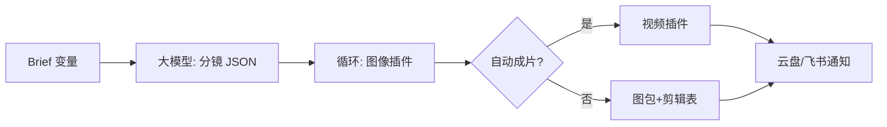
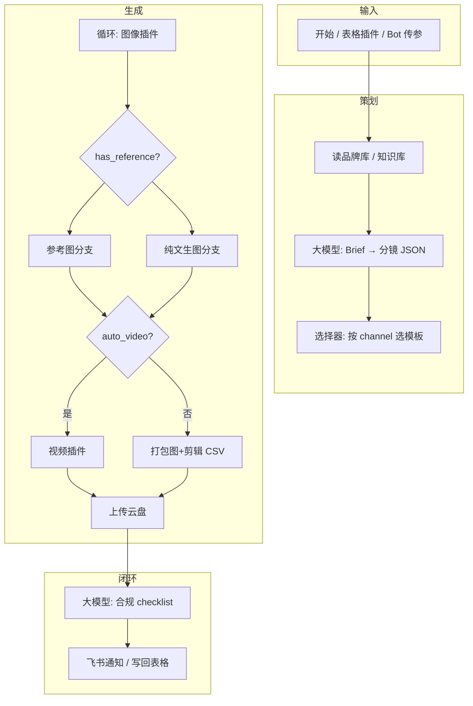

# 用 Coze 搭建「文生图 + 视频」电商产品宣传物料工作流

> 主题：文生图视频制作 · 平台：Coze（扣子）· 场景：电商产品宣传物料（主图、详情页短视频、投放素材等）  
> 适用读者：电商运营、投放、设计协作、Coze Bot/工作流搭建者

---

## 目录

1. [需求说明](#1-需求说明)
2. [解决方案总览（Coze 视角）](#2-解决方案总览coze-视角)
3. [文生图与图生视频原理](#3-文生图与图生视频原理)
4. [模型能力与边界](#4-模型能力与边界)
5. [提示词工程（电商物料）](#5-提示词工程电商物料)
6. [Coze 工作流搭建](#6-coze-工作流搭建)
7. [国内 API 对接示例（Coze）](#7-国内-api-对接示例coze)
8. [品类完整分镜样例](#8-品类完整分镜样例)
9. [落地清单与常见坑](#9-落地清单与常见坑)

---

## 1. 需求说明

### 1.1 业务背景：电商为什么需要「文生图 + 视频」

电商物料生产面临 **多 SKU × 多渠道 × 短周期** 的压力：同一产品要在主图、详情、短视频、广告创意里反复出现，且各平台规格不同。传统「运营提需求 → 设计排期 → 拍摄剪辑」在测款和大促场景下经常 **排期瓶颈** 先于 **创意瓶颈** 出现。

AI 文生图/视频的目标应是：

- **提速**：小时级出分镜与氛围图，而非天级。  
- **降本**：把重复场景、模板化短视频交给工作流。  
- **可测**：同一 Brief 多版 prompt / 钩子，服务投放 A/B。  
- **可控**：品牌、合规、终审仍由人与规则把关。

### 1.2 要产出什么（物料清单）

| 需求类型 | 典型产出 | 尺寸/时长 | 期望 |
|---------|---------|----------|------|
| 主图 / 卖点图 | 白底、场景、对比 | 1:1、3:4 | 店铺模板一致、批量换 SKU |
| 详情切片 | 卖点条图、场景序列 | 790 宽、竖版 | 叙事清晰 |
| 短视频 | 种草、展示、口播稿 | 9:16，15–60s | 分镜+口播一体，可进剪映 |
| 投放 | 信息流、千川素材 | 多比例 | 多钩子、快速迭代 |
| 大促 | banner、预告片头 | 套图 | 换活动名/SKU 即可复跑 |

### 1.3 角色与诉求

| 角色 | 诉求 | Coze 形态 |
|------|------|-----------|
| 运营 | 飞书里一句话触发 | Bot → 调工作流 |
| 投放 | 表格批量、版本可追溯 | 多维表格 + 工作流 API |
| 设计 | 少改结构、多改风格 | Prompt 模板 + 视觉 DNA |
| 合规 | 风险可见 | 工作流末尾合规 LLM + 人工预览 |

### 1.4 痛点

1. **角色多、口径不一**：运营、设计、投放对「好视频」定义不同，返工多。  
2. **工具链分散**：写脚本、出图、剪辑在不同工具，上下文丢失。  
3. **批量难**：上百 SKU 时，纯 Bot 对话不可控，需 **工作流 + 表格**。  
4. **平台规则严**：虚假宣传、功效、对比用语需固定审查。  
5. **资产沉淀弱**：优秀 prompt、分镜结构未进入团队库。  
6. **模型误用**：把「不像实物的 AI 图」直接当主图，引发客诉与违规。

### 1.5 电商业务流程

```text
选品 / 上新 → Brief → 视觉策略 → AI 生产（分镜/图/视频草稿）
→ 人工精修 & 实拍补位 → 合规审核 → 多平台适配 → 投放/上架 → 数据回流 → 迭代
```

### 1.6 嵌入业务流程（Coze 卡点）

| 阶段 | 嵌入 | 说明 |
|------|------|------|
| Brief | 飞书多维表格一行 = 一 SKU | 插件读表写入工作流变量 |
| 策划 | 知识库 / 文档插件 | 品牌与类目话术 |
| 生产 | 工作流：LLM 分镜 → 图像插件循环 → 视频插件 | 失败走降级分支 |
| 审核 | 合规 LLM + 仅内网预览链接 | 高风险不自动外发 |
| 上架 | 云盘插件 + 回写表格 `asset_id` | 闭环 |
| 迭代 | 表格字段 `prompt_version` | 对比投放效果 |

---

## 2. 解决方案总览（Coze 视角）

### 2.1 Coze 的定位：Bot + 工作流 + 插件

```text
业务方（IM/表格/API）
  → Coze Bot 或工作流
  → 大模型（分镜/口播/合规）
  → 插件（文生图、视频、飞书、云盘）
  → 交付物 + 回写
```

| 组件 | 作用 |
|------|------|
| **Bot** | 自然语言改稿、试风格、触发标准工作流 |
| **工作流** | 固定输入输出、批量、可 API 化 |
| **插件** | 图像/视频生成、读表、通知、HTTP 自定义 |
| **知识库** | 品牌手册、钩子库、禁用词（Bot 侧或工作流检索） |

### 2.2 推荐双轨策略

| 轨道 | 场景 |
|------|------|
| **探索轨（Bot）** | 单 SKU 试钩子、试画风、改口播 |
| **生产轨（工作流）** | 表格批量、标准上新、夜跑 API |

### 2.3 三种成熟度

| 级别 | 产出 | 适用 |
|------|------|------|
| L1 | 口播 + 分镜 + prompt 包 | 强合规、重实拍类目 |
| L2 | 自动场景图 + 剪映 JSON | 家居、美妆氛围 |
| L3 | 场景图 + 插件自动短视频 | 测款铺量 |

---

## 3. 文生图与图生视频原理

### 3.1 文生图：扩散 + 文本条件

1. 图像从 **噪声** 经多步 **去噪** 生成。  
2. **Prompt** 经文本编码器变为语义向量，在去噪过程中 **条件控制** 画面内容。  
3. 常见架构：Text Encoder + U-Net/DiT + VAE。

```text
用户描述「厨房里的咖啡机，晨光」
  → 语义向量
  → 去噪网络按语义收敛
  → 得到「像该描述」的像素图（非数据库精确拷贝）
```

### 3.2 影响成片质量的关键杠杆

| 杠杆 | 说明 |
|------|------|
| Prompt 结构 | 主体、场景、光影、风格、构图 |
| Negative prompt | 抑制畸形、乱码、低质（SD 系） |
| 参考图 | img2img、IP-Adapter、ControlNet — **电商贴产品靠这条** |
| seed | 固定构图，便于多尺寸延展 |
| 模型与 LoRA | 特定画风、品类微调 |

### 3.3 图生视频 vs 剪辑合成

| 方式 | 原理 | 电商建议 |
|------|------|---------|
| 图生视频 | 视频扩散，以图作条件生成运动帧 | 适合氛围、空镜；产品特写慎用 |
| 分镜 + 剪辑 | 多图 + Ken Burns + 字幕 + BGM | **主流程推荐**，可控可审 |

Coze 插件链常见做法：**图像插件出分镜 → 视频插件做短动效 → 或输出 ZIP+CSV 给剪映模板**。

### 3.4 Coze 链路数据流



---

## 4. 模型能力与边界

### 4.1 文生图能力矩阵

| 能力 | 可靠度 | 电商用法 |
|------|--------|---------|
| 生活方式场景 | 高 | 氛围主图、背景 |
| 统一色调/风格 | 中高 | visual_dna 后缀 |
| 复杂产品精确外形 | 低 | 必须实拍 reference |
| 包装文字/参数 | 很低 | 后期叠字或实拍 |
| Logo / 商标 | 很低 | 矢量后期 |
| 人手、人脸 | 中低 | 少特写，多产品镜头 |

### 4.2 图生视频边界

- 片段时长短，长视频需拼接。  
- 运动一大，产品边缘、标签易 **漂移/融化**。  
- 不适合承载 **精确口播字幕**（字幕应后期轨）。  
- 数字人需专用链路，非通用图生视频替代。

### 4.3 合规边界（工作流必须拦截）

- 绝对化、医疗功效、未经证实的对比。  
- 未授权肖像、竞品标识。  
- 平台对 AI 内容标注要求（知识库需可更新）。  
- **生成图默认不可直接对外**，除非类目 SOP 允许且已过审。

### 4.4 Coze 选型与分支策略

在工作流 **选择器** 中：

- `has_product_photo = true` → 图像插件 img2img / 图生图（带参考 URL）  
- `category in 高实物类目` 且无参考图 → **跳过出图**，只出文案包  
- `need_video = true` 且 `risk_level = low` → 视频插件；否则只出图包

---

## 5. 提示词工程（电商物料）

### 5.1 通用结构

```text
[主体 Subject] + [环境 Context] + [构图 Composition] + [光线 Lighting]
+ [风格 Style/Medium] + [约束 Constraints] + [质量 Quality]
```

**Negative 示例**：`blurry, watermark, random text, logo, deformed, extra fingers, lowres`

### 5.2 品类示例

**美妆 — 氛围场景**

```text
Positive:
{product_name} on marble vanity table, soft morning light, clean aesthetic,
pastel tones, instagram style product photography, 3:4 vertical, space at bottom for text

Negative:
messy background, harsh shadow, incorrect label text, brand logos
```

**3C — 功能感**

```text
Positive:
{product_name} floating on minimal dark gradient background, rim light, tech product hero shot,
sharp edges, cinematic, center framed, 1:1

Negative:
distorted ports, unreadable screen UI, fake specifications text
```

### 5.3 分镜 JSON（大模型节点输出规范）

```json
{
  "hook": "还在用老方法？3秒看懂差别",
  "visual_dna": "minimal, warm white, soft shadow, no logos",
  "scenes": [
    {
      "id": 1,
      "duration_sec": 3,
      "narration_cn": "一键启动，省时一半。",
      "image_prompt_en": "Close-up of {product_name} on desk, finger pressing power button, soft daylight, product ad style",
      "negative_prompt": "deformed hands, text, logo",
      "subtitle_safe_area": "bottom"
    }
  ],
  "cta": "点击了解详情"
}
```

**大模型系统提示要点**：

- 仅输出 JSON；口播中文；image_prompt 英文；单镜 prompt ≤ 300 字符。  
- 禁止竞品名、违规功效；钩子符合 channel（抖/淘/红）。  
- 所有 scene 共享 `visual_dna` 字符串。

### 5.4 渠道差异化

| channel | 钩子 | 画面 | 口播 |
|---------|------|------|------|
| douyin | 痛点/反常识 | 9:16，近景，快切 | 短句，≤15 字/镜 |
| taobao | 卖点直给 | 1:1 主体大 | 参数、利益点 |
| xiaohongshu | 体验故事 | 3:4 生活感 | 第一人称 |
| ad_feed | 3秒停留 | 高对比，留白 CTA | 行动号召 |

Coze 工作流用 **选择器** 加载不同 few-shot 示例（可存知识库文档）。

### 5.5 钩子库（知识库维护）

```text
- 「我以为很贵，直到算了一笔账…」
- 「同样预算，为什么她家用起来更省心？」
- 「这一个小设计，省了我每天10分钟。」
```

工作流变量 `hook_style=random` 时，LLM 从知识库 Top-K 抽样，避免千篇一律。

### 5.6 Prompt 版本与 A/B

表格列建议：

| 列名 | 说明 |
|------|------|
| `prompt_version` | v1.0-hook-A |
| `visual_dna` | 风格锁 |
| `seed` | 可选 |
| `workflow_run_id` | Coze 运行 ID |
| `ctr` / `conversion` | 回流投放数据 |

### 5.7 Bot 侧「改稿」与生产轨协同

- Bot 对话微调口播 → 用户确认 → 调用工作流 `run` 传入最终变量。  
- 避免 Bot 直接批量出图 **无版本记录**；批量必须走工作流。

---

## 6. Coze 工作流搭建

### 6.1 总体示意图



### 6.2 节点清单

| 顺序 | 模块 | 作用 |
|-----|------|------|
| 1 | 开始 | 变量：product_name, selling_points, channel, duration, need_video, reference_url |
| 2 | 插件-读表 | 从飞书多维表格拉 SKU 行 |
| 3 | 大模型 | 输出分镜 JSON（5.3） |
| 4 | 选择器 | channel → 不同 system prompt |
| 5 | 循环 | 每 scene 调图像插件 |
| 6 | 选择器 | 失败重试 1 次 → 降级文案包 |
| 7 | 视频插件 / HTTP | 合成或输出时间线 |
| 8 | 大模型 | 合规扫描 + 修改建议 |
| 9 | 插件 | 上传云盘、飞书消息、写回表格 |
| 10 | 结束 | 返回 asset 链接与 run_id |

### 6.3 Bot 与工作流分工

| 形态 | 适用 |
|------|------|
| 仅 Bot | 灵感、单镜试风格、改口播 |
| Bot 调工作流 | 「跑表格第 12 行」 |
| 仅工作流 API | ERP/夜跑批量 |

### 6.4 插件与 HTTP 自定义

若内置图像插件不满足（需 ControlNet、私有 SD）：

- 使用 **HTTP 插件** 调自建网关，请求体与 Dify 类似：`prompt`, `negative_prompt`, `width`, `height`, `reference_url`, `seed`。  
- 响应统一 `{ "image_url": "..." }`，便于循环节点引用。

### 6.5 电商技巧

- **片尾标板**：最后一镜固定 prompt 模板（品牌色背景 + 留白 logo 区）。  
- **A/B 旁白**：变量 `tone=rational|emotional` 并行两路 LLM 输出。  
- **大促**：`campaign` 变量切换知识库章节与 banner 文案。  
- **降级**：图像插件失败 → 仍输出口播 + 分镜表，@设计 补图。

---

## 7. 国内 API 对接示例（Coze）

> 万相 / 火山 / 可灵 / MiniMax 完整 payload、三品类 JSON 全文见：[[文生图视频制作-国内API与品类分镜样例]]  
> Coze 侧推荐：**HTTP 插件（或自定义插件）→ 自建 media-gateway**，避免在工作流里写轮询 Secrets。

### 7.1 架构：Coze 循环节点 → HTTP 插件 → 网关

```text
飞书表格 / Bot 传参
  → 大模型：分镜 JSON
  → 循环：每 scene 调 HTTP 插件 generate_image
  → 网关：万相异步 + 轮询 + 转存 CDN
  → 变量 image_url 写入数组 → 视频插件 / 合成 HTTP
  → 云盘插件 + 飞书通知
```

### 7.2 创建 Coze「HTTP 请求」插件

**插件 1：`generate_scene_image`**

| 项 | 配置 |
|----|------|
| 方法 | POST |
| URL | `https://media-gateway.yourcompany.com/v1/image/generate` |
| Header | `Authorization: Bearer {{GATEWAY_TOKEN}}` |
| 输入参数 | `prompt`(string), `negative_prompt`(string), `width`(number), `height`(number), `reference_url`(string, 可选), `reference_strength`(number), `provider`(string) |
| 输出 | `image_url`(string), `seed`(number), `job_id`(string, 可选) |

**请求 Body 模板**：

```json
{
  "prompt": "{{prompt}}",
  "negative_prompt": "{{negative_prompt}}",
  "width": {{width}},
  "height": {{height}},
  "reference_url": "{{reference_url}}",
  "reference_strength": {{reference_strength}},
  "provider": "{{provider}}"
}
```

**输出映射**（插件配置界面）：

```json
{
  "image_url": "$.image_url",
  "seed": "$.seed"
}
```

### 7.3 工作流循环节点绑定

对每个 `scenes[i]`：

| 循环变量 | 来源 |
|---------|------|
| prompt | `scenes[i].image_prompt_en`（替换 `{product_name}`） |
| negative_prompt | `scenes[i].negative_prompt` |
| width / height | channel 映射：douyin→768×1024，taobao→1024×1024 |
| reference_url | `use_reference_image=true` 时取表格 `reference_url`，否则空 |
| reference_strength | `scenes[i].reference_strength` 默认 0.35 |
| provider | 表格列 `image_provider` 或默认 `wanx` |

循环输出聚合为 `image_urls[]`，供下游视频/合成节点使用。

### 7.4 插件 2：`poll_media_job`（异步 API）

万相、可灵等返回 `job_id` 时使用：

```json
GET https://media-gateway.yourcompany.com/v1/jobs/{{job_id}}
```

工作流逻辑：

1. `generate_scene_image` 若返回 `status=pending`，进入 **选择器**  
2. 调用 `poll_media_job`，最多循环 15 次，间隔 2s（Coze 循环或子工作流）  
3. `succeeded` → 写 `image_url`；`failed` → 走降级分支  

> 更简单做法：轮询全部放在 **网关内部**，Coze 只收同步 `image_url`（推荐）。

### 7.5 直连阿里万相（Coze HTTP 插件 · 两步）

**插件 A `wanx_create`**

```http
POST https://dashscope.aliyuncs.com/api/v1/services/aigc/text2image/image-synthesis
X-DashScope-Async: enable
```

Body：`model`, `input.prompt`, `parameters.size`, `parameters.seed`  
输出：`task_id`

**插件 B `wanx_query`**

```http
GET https://dashscope.aliyuncs.com/api/v1/tasks/{{task_id}}
```

输出：`task_status`, `results[0].url`  
⚠️ 拿到 url 后 **必须** 再调 `upload_to_oss` 插件，否则飞书消息里图片会过期。

### 7.6 图生视频：可灵 HTTP 插件

**插件 3：`kling_image2video`**

```json
POST https://media-gateway.yourcompany.com/v1/video/image2video

{
  "image_url": "{{image_url}}",
  "prompt": "product stays stable, slow push-in",
  "duration": 5,
  "provider": "kling"
}
```

工作流 **选择器**：仅 `scene_id in [1,2]` 且 `auto_video=true` 时调用，其余镜走 compose。

### 7.7 插件 4：`compose_video`（分镜合成）

```json
POST https://media-gateway.yourcompany.com/v1/compose

{
  "sku_id": "{{sku_id}}",
  "resolution": "1080x1920",
  "scenes": {{scenes_with_image_urls}}
}
```

输出 `mp4_url` → **云盘插件**上传 → 飞书卡片消息带永久链接。

### 7.8 飞书表格列与 API 字段对照

| 表格列 | API / 工作流 |
|--------|-------------|
| `reference_url` | img2img 必填（服饰/3C hero） |
| `image_provider` | wanx / volcengine |
| `video_provider` | kling / compose |
| `prompt_version` | 回写，便于投放复盘 |
| `asset_mp4_url` | compose 完成后写回 |

### 7.9 Bot 触发示例话术

```text
用户：帮表格第 8 行跑一遍物料，渠道抖音，要视频
Bot → 解析 row=8 → workflow.run({
  sku_id, product_name, selling_points, channel: "douyin",
  need_video: true, reference_url, category: "beauty_skincare"
})
```

---

## 8. 品类完整分镜样例

三套完整 JSON（含 6–7 镜、口播、image_prompt、合规说明）见：[[文生图视频制作-国内API与品类分镜样例]] §8。  
以下为 Coze 工作流配置要点摘要。

### 8.1 美妆 · 烟酰胺精华液（30s · 抖音）

| 配置项 | 值 |
|--------|-----|
| category | `beauty_skincare` |
| 画幅 | 768×1024（9:16） |
| reference 镜 | 1、4、6 |
| image_provider | wanx repaint |
| video | compose 为主；hero 镜可选 kling 5s |
| 合规 | 知识库禁用「美白」「根治」 |

### 8.2 3C · 无线降噪耳机（45s · 信息流）

| 配置项 | 值 |
|--------|-----|
| category | `3c_audio` |
| 画幅 | 1080×1920 |
| reference 镜 | 2、4、5、7 |
| 抽象镜 | 3（ANC）、6（蓝牙）纯文生图 |
| video | **compose 优先**，避免产品变形 |

### 8.3 服饰 · 轻量防风风衣（30s · 小红书）

| 配置项 | 值 |
|--------|-----|
| category | `fashion_outerwear` |
| 画幅 | 768×1024（3:4） |
| reference 镜 | 1、5（锁版型色） |
| reference_strength | 0.35–0.45 |
| 人工卡点 | 镜 3 街景模特终审 |

### 8.4 大模型 few-shot 配置

在 Coze 工作流「大模型」节点 system prompt 中：

```text
根据 category 输出与知识库示例同结构的 JSON：
- beauty_skincare → 6镜30s
- 3c_audio → 7镜45s  
- fashion_outerwear → 6镜30s
字段：meta, hook, scenes[], audio, cta
```

将配套文档 §8.1–8.3 **完整 JSON 存入 Bot 知识库**，检索后作为示例。

---

## 9. 落地清单与常见坑

### 9.1 Checklist

- [ ] 飞书表结构：SKU、卖点、渠道、reference、prompt_version  
- [ ] 知识库：禁用词、钩子库、渠道 few-shot、尺寸表  
- [ ] 工作流 API 权限与限流  
- [ ] 输出默认「内部预览」权限  
- [ ] 合规 LLM 二次扫描启用  
- [ ] 与剪映/ CapCut 模板字段对齐（CSV 列名）  

### 9.2 常见坑

| 现象 | 原因 | 对策 |
|------|------|------|
| 批量结果风格飘 | 无 visual_dna | JSON 强制共享字段 + 图像插件统一后缀 |
| 产品不像 | 纯文生图 | 表格必填 reference_url |
| 飞书通知图裂 | 临时 URL 过期 | 上传云盘拿永久链 |
| 口播违规 | LLM 幻觉 | 合规节点 + 知识库禁用词 |
| Bot 与工作流版本不一致 | 双轨未同步 | prompt 模板只维护一份（知识库） |

---

## 10. 小结

Coze 把电商「文生图 + 视频」做成 **业务方可触达的生产线**：**Bot 负责灵活改稿，工作流负责批量与格式，插件负责真出图出视频**。落地成败取决于是否 **尊重模型边界**（实物、文字、logo 实拍/后期补位），以及是否用 **分层 Prompt、visual_dna、prompt_version** 把创意变成可测、可审计的资产。
