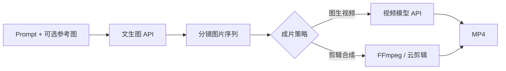
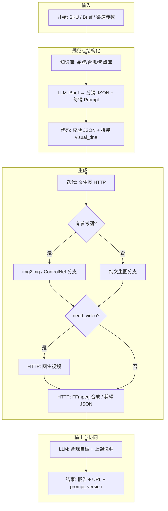

# 用 Dify 搭建「文生图 + 视频」电商产品宣传物料工作流

> 主题：文生图视频制作 · 平台：Dify · 场景：电商产品宣传物料（主图、详情页短视频、投放素材等）  
> 适用读者：电商运营、内容投放、品牌设计、AI 工作流搭建者

---

## 目录

1. [需求说明](#1-需求说明)
2. [解决方案总览（Dify 视角）](#2-解决方案总览dify-视角)
3. [文生图与图生视频原理](#3-文生图与图生视频原理)
4. [模型能力与边界](#4-模型能力与边界)
5. [提示词工程（电商物料）](#5-提示词工程电商物料)
6. [Dify 工作流搭建](#6-dify-工作流搭建)
7. [国内 API 对接示例（Dify）](#7-国内-api-对接示例dify)
8. [品类完整分镜样例](#8-品类完整分镜样例)
9. [落地清单与常见坑](#9-落地清单与常见坑)

---

## 1. 需求说明

### 1.1 业务背景：电商为什么需要「文生图 + 视频」

电商竞争已从「有图就能卖」进入 **内容密度战**：同一 SKU 要在淘宝/京东主图、抖音/小红书短视频、信息流广告、直播间切片里反复出现。传统流程是：

- 运营写 Brief → 设计排期 3–7 天 → 拍摄/修图 → 剪辑 → 多尺寸适配 → 合规审核 → 上架

在 **SKU 多、渠道多、测款快** 的店铺里，这条链路有三个结构性矛盾：

| 矛盾 | 表现 |
|------|------|
| 速度 vs 质量 | 大促前 48 小时要 200+ 套变体，设计人力不够 |
| 统一 vs 差异 | 品牌要一致，投放又要 A/B 多风格 |
| 创意 vs 合规 | 卖点要吸睛，平台对功效、对比、价格表述极严 |

「文生图 + 文生/图生视频」的价值不是替代全部设计，而是 **把 80% 可模板化的物料（场景图、分镜图、短视频底稿）自动化**，让人力集中在 **真实产品摄影、精修、终审** 上。

### 1.2 要产出什么（物料清单）

| 需求类型 | 典型产出 | 尺寸/时长参考 | 对 AI 的期望 |
|---------|---------|--------------|-------------|
| 主图 / 卖点图 | 白底图、场景图、对比图、信息图 | 1:1（800×800+）、3:4 | 风格统一、可批量变体、留文案区 |
| 详情页模块 | 卖点长图、使用场景、前后对比 | 790 宽条图、竖版切片 | 分镜感强、逻辑清晰 |
| 短视频 | 产品展示、种草、功能演示感 | 9:16，15–60s | 分镜可控、口播/字幕可配 |
| 投放素材 | 信息流、千川/磁力引擎 | 9:16、16:9、1:1 | 多钩子、快速迭代 |
| 大促 / 上新 | 系列 banner、预告片头 | 多尺寸套图 | 模板化换 SKU、换活动名 |

### 1.3 角色与诉求（谁在意什么）

| 角色 | 核心诉求 | 对系统的隐含要求 |
|------|---------|----------------|
| 运营 | 快、能改、能批量 | 表单/Brief 一次填完，输出可下载 |
| 设计 | 品牌一致、少返工 | 固定视觉 DNA、可注入参考图 |
| 投放 | 可测、可复盘 | 保留 prompt 版本、A/B 分支 |
| 法务/合规 | 不违规、可追溯 | 禁用词库、自检报告、人工卡点 |
| 技术 | 可维护、可对接 | API、Webhook、日志与 Run ID |

### 1.4 痛点（为什么单靠设计师或单靠模型都不够）

1. **需求碎片化**：「明天就要」、渠道规格各异、SKU 上百，人工排期跟不上。  
2. **一致性难**：色调、机位、卖点表述在多人协作下易漂移。  
3. **合规与品牌**：禁用词、logo 区、功效宣称、竞品对比，纯人工检查易漏。  
4. **图→视频断层**：文生图容易，分镜、时长、转场、配音/字幕往往另开工具链。  
5. **可追溯性差**：版本多、谁改的、依据哪版 Brief，难以审计。  
6. **模型幻觉**：产品形态、包装文字、材质细节与实物不符，直接上架风险高。

### 1.5 电商业务流程（端到端）

```text
选品 / 上新
  → 卖点提炼 & Brief（人群、渠道、禁忌、参考竞品）
  → 视觉策略（主图类型、视频结构、品牌模板）
  → AI 辅助生产（分镜 → 文生图 → 图生视频/剪辑表）
  → 人工精修 & 实拍补位（真实产品图、logo、价格标）
  → 合规审核（平台规则 + 品牌手册）
  → 多平台适配（尺寸、时长、封面、标题）
  → 投放 / 上架
  → 数据回流（CTR、完播、转化）
  → 迭代 Brief & Prompt 模板
```

### 1.6 如何嵌入业务流程（Dify 卡点设计）

| 业务阶段 | 嵌入方式 | 输入/输出 |
|---------|---------|----------|
| Brief | Dify 对话应用或「开始」表单 | 入：SKU、受众、渠道、画幅、禁忌；出：结构化 JSON |
| 策划 | 知识库 + LLM | 出：分镜表、口播稿、每镜 image_prompt |
| 生产 | Workflow 迭代 + HTTP 工具 | 出：图片 URL 列表、可选 mp4 |
| 审核 | LLM 自检 + 人工节点（可选） | 出：风险清单、通过/驳回 |
| 上架 | Webhook → PIM/素材库 | 出：版本号、渠道标签、文件 URL |
| 迭代 | 保留 Workflow Run 参数 | 对比 A/B prompt_version |

**原则**：AI 产出默认标记为 **「待精修草稿」**，除非类目允许纯生成图（如虚拟场景、氛围图）且已过合规。

---

## 2. 解决方案总览（Dify 视角）

### 2.1 Dify 在链路中的定位

Dify 不是图像/视频模型本身，而是 **编排与规范中枢**：

```text
Brief（人） → Dify（结构化 + 知识库 + 提示词） → 外部模型 API（出图/出视频） → Dify（组装 + 审核报告） → 业务系统（人终审）
```

| 能力 | Dify 负责 | 外部服务负责 |
|------|----------|-------------|
| Brief 解析 | ✅ LLM + 表单 | — |
| 品牌/合规知识 | ✅ 知识库检索 | — |
| 提示词生成 | ✅ LLM（可模板化） | — |
| 像素级出图 | 编排 | 文生图 API（SD、MJ、国内合规接口等） |
| 视频渲染 | 编排 | 图生视频 API / FFmpeg 微服务 |
| 真实 SKU 精修 | — | 设计工具 + 实拍资产 |

### 2.2 推荐架构：Workflow + 轻量合成服务

1. **输入层**：`sku_id`、`product_name`、`category`、`selling_points[]`、`target_audience`、`channel`、`aspect_ratio`、`need_video`、`reference_image_url`（可选）。  
2. **规范层**：知识库（品牌手册、禁用词、类目话术）+ LLM → 分镜 JSON。  
3. **生成层**：迭代节点逐镜调用文生图 HTTP；条件分支决定是否图生视频。  
4. **组装层**：HTTP 调用 `/compose`（Ken Burns + 字幕轨 + BGM 占位）或输出剪辑 JSON 给剪映模板。  
5. **输出层**：Markdown 报告 + OSS URL + Webhook 回写。

### 2.3 三种落地模式（按成熟度）

| 模式 | 描述 | 适用 |
|------|------|------|
| L1 文案+分镜 | 只出脚本、分镜、prompt，人工出图剪辑 | 刚起步、强合规类目 |
| L2 图自动化 | 自动出场景图/氛围图，视频靠剪辑模板 | 美妆、家居、3C 氛围图 |
| L3 图+短视频 | 分镜图 + 轻量自动成片 | 测款、信息流大量铺量 |

---

## 3. 文生图与图生视频原理

> 理解原理才能写好 Prompt、选对模型、知道哪里必须人工介入。

### 3.1 文生图核心：扩散模型（Diffusion）

主流文生图（Stable Diffusion、DALL·E、Midjourney、Flux 等）大多基于 **扩散模型**：

1. **训练阶段**：模型学习「如何从纯噪声逐步去噪还原成图像」。  
2. **推理阶段**：从随机噪声出发，多步迭代去噪，得到最终像素。  
3. **文本条件**：提示词经 **文本编码器**（如 CLIP、T5）变成向量，在去噪每一步 **引导** 图像朝语义方向收敛。

```text
Prompt 文本
  → Text Encoder（语义向量）
  → U-Net / DiT（去噪网络，每步受文本向量条件控制）
  → VAE Decoder（潜空间 → RGB 图像）
```

**对电商的启示**：模型生成的是「训练分布里像该描述的东西」，不是「数据库里这一 SKU 的精确拷贝」。

### 3.2 提示词如何影响画面

| 机制 | 说明 | 电商应用 |
|------|------|---------|
| 主语优先 | 句首主体权重往往更高 | 产品名、品类放前面 |
| 风格词 | `cinematic`、`product photography` 等触发整体调性 | 固定品牌后缀 |
| 负面提示 | SD 系 `negative_prompt` 抑制低质量元素 | 抑制畸形手、乱码文字 |
| 参考图（IP-Adapter / ControlNet / img2img） | 用边缘、深度、姿态或风格图约束 | **真实产品图做参考** 是电商正解 |
| 种子（seed） | 固定 seed 可复现相近构图 | 同 SKU 多尺寸时用同一 seed + 不同 crop |

### 3.3 从「单张图」到「视频」的两条路径

| 路径 | 原理 | 优点 | 缺点 |
|------|------|------|------|
| **图生视频** | 以关键帧为条件，视频扩散模型生成时序帧（如 SVD、可灵、Runway、Minimax 等） | 动效自然、适合氛围镜头 | 产品细节易漂移、时长有限 |
| **分镜图 + 剪辑合成** | 文生图产出 N 张分镜 → Ken Burns/转场/字幕/配音 | 可控、成本低、易合规 | _motion 感弱，偏 slideshow |

电商实操常见组合：**真实产品 hero 图（实拍）+ AI 场景分镜 + 剪辑模板成片**。

### 3.4 「文生图视频」在 Dify 里的数据流



---

## 4. 模型能力与边界

### 4.1 文生图：擅长 vs 不擅长

| 擅长 | 不擅长 / 需人工 |
|------|----------------|
| 氛围场景、生活方式构图 | **包装上的准确文字、条码、规格参数** |
| 材质、光影、色系统一 | **与实物 1:1 一致的产品外形**（尤其复杂结构） |
| 快速出多风格 A/B | **品牌 logo 精确还原**（除非矢量后期叠） |
| 虚拟模特、场景人物 | **手指、文字、对称结构** 偶发畸形 |
| 白底/纯色背景风格化 | 平台要求的 **真实质检、资质图** |

### 4.2 图生视频：边界

- **时长短**：常见 3–10s 片段，长视频需多段拼接。  
- **主体漂移**：镜头运动大时，产品轮廓、标签会变形。  
- **文字与 logo**：几乎不可依赖模型内嵌文字。  
- **口型同步**：若需数字人口播，应走专用数字人/ TTS+口型链路，而非普通图生视频。

### 4.3 电商合规边界（必须人工或规则拦截）

- 禁止绝对化用语（「最」「第一」「100% 有效」等，视平台而定）。  
- 医疗、功效、对比实验类表述需资质。  
- 未授权明星/竞品/logo 不可生成。  
- AI 生成内容在部分平台需 **标注「AI 生成」**（政策变动快，需知识库定期更新）。

### 4.4 选型建议（接入 Dify HTTP 工具时）

| 场景 | 倾向 | 备注 |
|------|------|------|
| 批量、可控、可私有化 | Stable Diffusion / Flux + ControlNet | 适合 img2img 贴产品 |
| 高质量氛围、探索创意 | Midjourney | 接口需合规中转 |
| 国内部署与合规 | 国内云厂商图像 API | 注意备案与数据出境 |
| 短视频动效 | 国内图生视频 API + 剪辑兜底 | 关键帧用实拍更稳 |

**边界策略**：工作流里用 **条件分支** —— 有 `reference_image_url` 时走 img2img/ControlNet；无参考且类目为「强实物」时 **只出分镜与文案，不自动出图**。

---

## 5. 提示词工程（电商物料）

### 5.1 提示词分层结构（推荐）

```text
[主体] + [场景/用途] + [构图/机位] + [光影] + [风格/媒介] + [品牌约束] + [画幅/质量]
```

**Negative（SD 系）**：`blurry, deformed hands, extra fingers, watermark, random text, logo, low quality, oversaturated`

### 5.2 主图 / 场景图模板

**模板 A — 场景主图（家居小家电）**

```text
Positive:
A {product_name} placed on a clean modern kitchen counter, soft natural window light from left,
minimal Scandinavian interior, shallow depth of field, commercial product photography,
center composition, leave empty space at top for text overlay, 8k detail, photorealistic

Negative:
misleading text, brand logos, cluttered background, distorted product shape, cartoon
```

**模板 B — 白底产品（需配合后期或专用模型）**

```text
Positive:
{product_name}, pure white background, studio softbox lighting, e-commerce packshot,
orthographic front view, sharp edges, high detail product surface

Negative:
shadow clutter, colored background, reflection chaos, text on packaging unreadable
```

> 包装文字多时：**不要强逼文生图写对字** → 实拍抠图 + AI 只生成背景与场景。

### 5.3 分镜脚本 → 每镜 Prompt（给 Dify LLM 节点的系统提示要点）

要求 LLM 输出 JSON，例如：

```json
{
  "visual_dna": "warm tone, soft daylight, minimal props, brand color accent #E8A87C",
  "scenes": [
    {
      "scene_id": 1,
      "duration_sec": 3,
      "narration": "每天一杯，营养不将就。",
      "shot_type": "close-up",
      "image_prompt": "Close-up of hands holding {product_name} on wooden desk, morning sunlight, cozy lifestyle, product photography, shallow DOF",
      "negative_prompt": "deformed hands, extra fingers, text overlay, logo",
      "text_safe_area": "top-right empty for subtitle"
    }
  ]
}
```

**LLM 节点系统提示（摘要）**：

- 必须输出合法 JSON，禁止 markdown 包裹。  
- 每镜 `image_prompt` 英文为主（多数模型英文更稳），长度 ≤ 300 字符。  
- 固定拼接 `visual_dna`，仅替换产品相关描述。  
- 禁止生成竞品名、敏感功效词；口播用中文，图像 prompt 不含违规宣称。

### 5.4 渠道差异化（同一 SKU）

| 渠道 | 口播/字幕风格 | 画面风格 |
|------|-------------|---------|
| 抖音 | 3 秒钩子、短句、口语 | 竖屏 9:16，高对比，近景 |
| 淘宝主图 | 少字、参数清晰 | 1:1，主体居中，留促销区 |
| 小红书 | 种草、体验叙事 | 3:4，生活感，柔和滤镜 |
| 信息流广告 | 痛点→解决方案 | 前 2 镜强冲击，结尾 CTA 区留白 |

在 Dify 中用 **`channel` 变量** 切换知识库片段 + LLM few-shot 示例。

### 5.5 Prompt 版本管理与 A/B

| 字段 | 用途 |
|------|------|
| `prompt_version` | 如 `v1.2-scene-warm` |
| `seed` | 复现构图 |
| `model_id` | 追溯用的模型 |
| `run_id` | Dify Workflow Run ID |

便于投放复盘：「哪版 prompt + 哪张分镜」对应 CTR/转化。

### 5.6 Dify 代码节点：统一后缀示例（Python 伪代码）

```python
VISUAL_DNA = "commercial product photography, soft natural light, minimal background"
BRAND_SUFFIX = "color palette warm beige and white, no visible brand logos"

def build_prompt(scene_prompt: str, product_name: str) -> str:
    base = scene_prompt.replace("{product_name}", product_name)
    return f"{base}, {VISUAL_DNA}, {BRAND_SUFFIX}"
```

---

## 6. Dify 工作流搭建

### 6.1 总体示意图



### 6.2 节点级清单

| 顺序 | 节点 | 作用 |
|-----|------|------|
| 1 | 开始 | 必填变量、默认值、枚举（channel、aspect_ratio） |
| 2 | 知识库检索 | Top-K 品牌/合规/类目话术 |
| 3 | LLM | 输出分镜 JSON（见 5.3） |
| 4 | 代码 | JSON 校验、prompt 拼接、negative 注入 |
| 5 | 条件分支 | 有 `reference_image_url` → img2img |
| 6 | 迭代 | 每 scene 调用文生图 HTTP 工具 |
| 7 | 条件分支 | `need_video` → 图生视频或仅输出图包 |
| 8 | HTTP | `/compose` 或 OSS 上传 |
| 9 | LLM | 合规 checklist + 标题/标签建议 |
| 10 | HTTP Webhook | 回写 PIM/飞书/企业微信 |
| 11 | 结束 | 聚合交付物 |

### 6.3 HTTP 工具契约示例（文生图）

**Request**

```json
{
  "prompt": "...",
  "negative_prompt": "...",
  "width": 1024,
  "height": 1024,
  "seed": 42,
  "reference_image_url": "https://..."
}
```

**Response**

```json
{
  "image_url": "https://cdn.../scene_01.png",
  "seed": 42,
  "model": "flux-dev"
}
```

### 6.4 电商专用技巧

- **画幅映射表**：同一分镜驱动 1:1 / 3:4 / 9:16 三次请求，共享 seed。  
- **Hero 镜固定**：第 1 镜强制使用实拍 reference，后续镜 AI 场景。  
- **大促变量**：`campaign=618` 时切换知识库「大促话术」章节。  
- **失败降级**：文生图超时 → 仅输出文案 + 剪辑表，通知设计人工补图。

---

## 7. 国内 API 对接示例（Dify）

> 完整请求体、轮询逻辑、三品类分镜 JSON 见同目录：[[文生图视频制作-国内API与品类分镜样例]]  
> 原则：**Dify 不直连多家厂商**，建议经自建 `media-gateway` 统一鉴权、转存 CDN、异步轮询。

### 7.1 架构：Dify HTTP 节点 → 网关 → 国内 API

```text
Dify 迭代节点
  → POST /v1/image/generate（网关，同步或返回 job_id）
  → 网关内部：万相 / 火山 / 可灵
  → 网关：临时 URL 转存 OSS → 返回永久 image_url
  → Dify 变量 {{scene.image_url}} 写入下一节点
```

### 7.2 在 Dify 中注册「自定义工具 / HTTP 请求」

**工具名**：`generate_scene_image`

| 配置项 | 值 |
|--------|-----|
| Method | POST |
| URL | `https://media-gateway.yourcompany.com/v1/image/generate` |
| Headers | `Authorization: Bearer {{#env.GATEWAY_TOKEN#}}` |
| Body | 见下 |

```json
{
  "prompt": "{{#scene.image_prompt_en#}}",
  "negative_prompt": "{{#scene.negative_prompt#}}",
  "width": 768,
  "height": 1024,
  "seed": {{#scene.seed#}},
  "reference_url": "{{#scene.reference_url#}}",
  "reference_strength": {{#scene.reference_strength#}},
  "provider": "wanx"
}
```

**网关同步响应**（推荐 Dify 迭代节点直接用）：

```json
{
  "image_url": "https://cdn.yourcompany.com/sku/scene_01.png",
  "seed": 42,
  "provider": "wanx",
  "latency_ms": 8200
}
```

**网关异步响应**（需 Dify 代码节点或二次 HTTP 轮询）：

```json
{
  "job_id": "img-job-abc123",
  "status": "pending",
  "poll_url": "https://media-gateway.yourcompany.com/v1/jobs/img-job-abc123"
}
```

### 7.3 代码节点：轮询 + 转存（Python）

放在迭代节点之后，或封装进网关。Dify **代码节点** 示例：

```python
import httpx
import time

def main(job_id: str, gateway_token: str) -> dict:
    headers = {"Authorization": f"Bearer {gateway_token}"}
    url = f"https://media-gateway.yourcompany.com/v1/jobs/{job_id}"
    for _ in range(45):
        r = httpx.get(url, headers=headers, timeout=30).json()
        if r["status"] == "succeeded":
            return {"image_url": r["image_url"], "seed": r.get("seed")}
        if r["status"] in ("failed", "canceled"):
            raise Exception(r.get("error", "job failed"))
        time.sleep(2)
    raise TimeoutError(job_id)
```

### 7.4 直连阿里万相（无网关时 · HTTP 请求节点）

**步骤 1 — 创建任务**

- URL：`https://dashscope.aliyuncs.com/api/v1/services/aigc/text2image/image-synthesis`
- Header：`X-DashScope-Async: enable`，`Authorization: Bearer sk-xxx`
- Body：

```json
{
  "model": "wanx-v1",
  "input": {
    "prompt": "{{#LLM.scenes[0].image_prompt_en#}}"
  },
  "parameters": {
    "size": "768*1024",
    "n": 1,
    "seed": 42
  }
}
```

**步骤 2 — 轮询**（另 HTTP 节点，或由代码节点完成）

- GET `https://dashscope.aliyuncs.com/api/v1/tasks/{{task_id}}`
- 取 `output.results[0].url` → **必须**再 HTTP 上传 OSS（否则 24h 过期）

### 7.5 图生视频：可灵 + Dify 条件分支

当 `need_video=true` 且 `scene.use_i2v=true`：

```json
POST https://media-gateway.yourcompany.com/v1/video/image2video

{
  "image_url": "{{#scene.image_url#}}",
  "prompt": "product stays stable, slow push-in, minimal motion",
  "duration": 5,
  "provider": "kling"
}
```

响应经轮询后：

```json
{
  "clip_url": "https://cdn.../scene_01.mp4",
  "duration_sec": 5
}
```

多镜片段再调 `/v1/compose` 合并（见配套文档 §6）。

### 7.6 Dify 工作流变量映射（分镜 JSON → API）

| 分镜字段 | Dify 变量用法 | 对接 API 字段 |
|---------|--------------|--------------|
| `image_prompt_en` | 迭代 item | `prompt` |
| `negative_prompt` | 迭代 item | `negative_prompt` |
| `use_reference_image` | 条件分支 | 有则传 `reference_url` |
| `reference_strength` | 迭代 item | `0.25–0.45` |
| `motion` | 合成节点 | compose `motion` |
| `narration_cn` | 合成节点 | compose `subtitle` |

### 7.7 错误处理（Dify 条件分支）

| HTTP 状态 / 业务码 | 分支动作 |
|-------------------|---------|
| 429 限流 | 等待 5s 重试 1 次 |
| 任务 FAILED | 降级：该镜 `image_url=null`，报告标记「需人工补图」 |
| 轮询超时 | 输出分镜 JSON + CSV，Webhook 通知设计 |

---

## 8. 品类完整分镜样例

以下为三套 **可直接喂给 LLM 节点** 的完整 JSON（含 hook、6–7 镜、口播、prompt、合规备注）。  
完整版与 API 批处理映射见：[[文生图视频制作-国内API与品类分镜样例]]。

### 8.1 美妆 · 烟酰胺精华液（30s · 抖音）

| 项 | 内容 |
|----|------|
| SKU 示例 | SKU-BEAUTY-001 |
| 镜数 | 6 镜，合计 30s |
| 关键策略 | 镜 1/4/6 用实拍 reference；避免「美白」「7天见效」 |
| 视觉 | soft pastel, clean girl, 9:16 |

结构摘要：

```text
镜1 hero 特写(3s) → 镜2 质地 macro(5s) → 镜3 护肤 routine(6s)
→ 镜4 成分氛围(5s) → 镜5 匀净暗示(6s) → 镜6 CTA 留白(5s)
```

### 8.2 3C · 无线降噪耳机（45s · 信息流）

| 项 | 内容 |
|----|------|
| SKU 示例 | SKU-3C-002 |
| 镜数 | 7 镜，合计 45s |
| 关键策略 | 产品镜 img2img；降噪/连接镜用抽象可视化；少做图生视频 |
| 视觉 | dark tech gradient, rim light |

结构摘要：

```text
镜1 痛点场景(4s) → 镜2 hero 产品(5s) → 镜3 ANC 抽象(8s) → 镜4 续航(8s)
→ 镜5 IPX5(8s) → 镜6 蓝牙连接(7s) → 镜7 CTA(5s)
```

### 8.3 服饰 · 轻量防风风衣（30s · 小红书）

| 项 | 内容 |
|----|------|
| SKU 示例 | SKU-FASH-003 |
| 镜数 | 6 镜，合计 30s |
| 关键策略 | 平铺/挂拍 reference 锁版型色；街景镜 AI 生成需人工核对 |
| 视觉 | film grain, beige/olive, 3:4 |

结构摘要：

```text
镜1 flat lay(4s) → 镜2 面料 macro(5s) → 镜3 街景走路(6s)
→ 镜4 收纳(5s) → 镜5 两色展示(5s) → 镜6 软 CTA(5s)
```

### 8.4 LLM 节点 few-shot 用法

在 Dify LLM 系统提示末尾追加：

```text
当 category=beauty_skincare 时，输出结构参考 SKU-BEAUTY-001（6镜30s）；
当 category=3c_audio 时，参考 SKU-3C-002（7镜45s）；
当 category=fashion_outerwear 时，参考 SKU-FASH-003（6镜30s）。
必须输出合法 JSON，字段含 meta、hook、scenes[]、audio、cta。
```

将 [[文生图视频制作-国内API与品类分镜样例]] 中 §8.1–8.3 全文放入 **知识库**，检索 Top-1 作为示例。

---

## 9. 落地清单与常见坑

### 9.1 上线前 Checklist

- [ ] 知识库：品牌色、禁用词、类目合规、平台尺寸表  
- [ ] 每个 channel 至少 1 套 few-shot 分镜示例  
- [ ] 文生图 API 超时、重试、限流策略  
- [ ] 输出物默认带「待精修」水印或内部标签  
- [ ] Run 日志可关联 `sku_id` + `prompt_version`  
- [ ] 人工终审 SOP（谁审、审什么、驳回如何重跑）

### 9.2 常见坑

| 坑 | 原因 | 对策 |
|----|------|------|
| 产品不像 | 纯文生图 | 实拍 reference + img2img |
| 包装乱码 | 模型不擅长文字 | 后期叠字或实拍包装 |
| 视频人物脸崩 | 图生视频局限 | 少用人脸特写，多用产品镜头 |
| 合规踩线 | LLM 口播幻觉 | 知识库 + 合规 LLM 二次扫描 |
| 批量不一致 | 无 visual_dna | 代码节点强制后缀 + seed 策略 |

---

## 10. 小结

Dify 适合作为电商「文生图 + 视频」的 **编排与规范中枢**：用知识库和 Workflow 把 **需求 → 分镜 → 提示词 → 外部模型 → 审核 → 回写** 串成可复盘流水线。成功关键不在「全自动」，而在 **认清模型边界**（实物、文字、logo 必须人工或实拍补位），用 **分层 Prompt + 参考图 + 版本号** 保证可测、可控、可合规。
